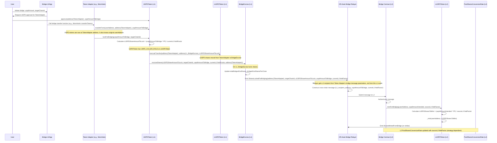
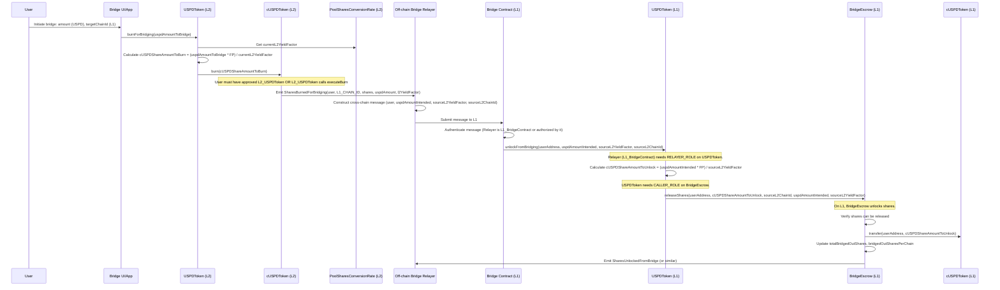

# Cross-Chain Bridge

USPD is designed to be a versatile stablecoin that operates seamlessly across multiple blockchain networks. While USPD is managing the liquidity on Ethereum mainnet, it is planned that USPD is deployed to most, if not all, other EVM chains as well as non-EVM chains. It should be possible to natively bridge the asset between the chains without sacrificing security.

## Problem Statement

To enhance USPD's utility, it needs to be transferable and usable across multiple blockchain networks (Layer 1s and Layer 2s). This presents several challenges:

1.  **Value Preservation:** USPD is a yield-bearing stablecoin. Its user-facing value (USPD amount) is derived from underlying, non-rebasing `cUSPD` share tokens and a dynamic `yieldFactor` (USPD = `cUSPD` shares * `yieldFactor` / `FACTOR_PRECISION`). This relationship must be maintained or accurately translated across chains.
2.  **Collateral Integrity:** All USPD, regardless of the chain it resides on, is backed by collateral held exclusively on the Ethereum mainnet (L1). The bridging mechanism must ensure that USPD on other chains (L2s) is fully backed by an equivalent value locked on L1.
3.  **Supply Accounting:** The `totalSupply` of USPD on L1 should accurately reflect the total system liability against the L1 collateral. Tokens moved to L2s should be accounted for as locked on L1, not burned, to maintain this clarity.
4.  **Yield Propagation:** The yield generated by the collateral on L1 (which increases the `yieldFactor`) should ideally be reflected in the USPD value on L2s, or at least, the bridging mechanism must account for `yieldFactor` discrepancies between chains at the time of transfer.
5.  **Security:** The bridging process must be secure, minimizing trust assumptions and protecting against exploits that could lead to unbacked USPD or loss of user funds.

## Proposed Solution: Architecture Overview

The proposed solution employs a lock-and-mint mechanism for L1-to-L2 transfers and a burn-and-unlock mechanism for L2-to-L1 transfers. This is facilitated by a set of smart contracts on L1 and corresponding contracts on L2s, with off-chain relayers handling message passing.

### Core Contracts Involved:

*   **`USPDToken.sol` (L1 & L2s):**
    *   The primary user-facing ERC20 token.
    *   On L1, it handles conversions between USPD amounts and `cUSPD` share amounts using the L1 `PoolSharesConversionRate`. It initiates bridging operations by interacting with the `BridgeEscrow` contract.
    *   On L2s, it provides the USPD view over L2 `cUSPD` shares, using the L2 `PoolSharesConversionRate`. It initiates bridging back to L1 by interacting with the L2 `cUSPDToken`.
*   **`cUSPDToken.sol` (L1 & L2s):**
    *   The core, non-rebasing ERC20 share token.
    *   On L1, its shares are transferred to and from the `BridgeEscrow` contract during bridging operations.
    *   On L2s, its shares are minted to users when bridging from L1 and burned when bridging back to L1.
*   **`BridgeEscrow.sol` (L1 only):**
    *   A dedicated contract responsible for holding all `cUSPD` shares locked on L1 that back USPD on L2s.
    *   Tracks the total `cUSPD` shares bridged out and maintains a per-chain accounting of these shares (`bridgedOutSharesPerChain[chainId]`).
    *   On L1, it locks/unlocks `cUSPD` shares.
    *   On L2s, it facilitates burning/minting of L2 `cUSPD` shares.
*   **`PoolSharesConversionRate.sol` (L1 & L2s):**
    *   Provides the `yieldFactor` used to convert between `cUSPD` shares and USPD amounts.
    *   The L1 instance reflects the true yield from mainnet collateral.
    *   L2 instances must be kept synchronized (or updated at relevant intervals/events) with the L1 `yieldFactor` to ensure accurate USPD value representation on L2s.

### Key Bridging Principle:

The user's intent is always to bridge a specific **USPD value**. This `uspdAmountIntended` by the user, along with the `yieldFactor` of the **source chain at the time of initiating the bridge**, determines a fixed quantity of `cUSPD` shares. This precise `cUSPD` share quantity is what is acted upon (locked on L1, minted on L2, burned on L2, or unlocked on L1) across the bridge. The `sourceYieldFactor` is always included in the cross-chain message to ensure consistent share calculation on the destination chain.

## Bridging Process Detailed

### 1. L1 (Mainnet) to L2 (e.g., Polygon, Arbitrum)

**Steps:**

1.  **User Interaction:** The user specifies the `uspdAmountToBridge` and the `targetChainId` through a bridge interface or by interacting with an integrated application.
2.  **L1 `USPDToken.lockForBridging(uspdAmountToBridge, targetChainId)`:**
    *   **User Approval:** The user approves a "Token Adapter" contract (e.g., a specific contract for a bridge provider like Wormhole) to spend their L1 `USPDToken`.
    *   **Token Adapter Pulls USPD:** The Token Adapter calls `L1_USPDToken.transferFrom(userAddress, address(TokenAdapter), uspdAmountToBridge)`, moving the USPD from the user to itself. The Token Adapter now knows the `userAddress` (original initiator).
    *   **Token Adapter Initiates Lock:** The Token Adapter (which must have `TOKEN_ADAPTER_ROLE` on `L1_USPDToken`) then calls `L1_USPDToken.lockForBridging(uspdAmountToBridge, targetChainId)`.
2.  **L1 `USPDToken.lockForBridging(uspdAmountToBridge, targetChainId)`:**
    *   This function is called by the Token Adapter (`msg.sender` is the Token Adapter) and requires `msg.sender` to have the `TOKEN_ADAPTER_ROLE`.
    *   It calculates `cUSPDShareAmountToLock = (uspdAmountToBridge * FACTOR_PRECISION) / currentL1YieldFactor`. The `currentL1YieldFactor` is fetched from the L1 `PoolSharesConversionRate`.
    *   **Share Transfer to Escrow:** `USPDToken` (which has `USPD_CALLER_ROLE` on `cUSPDToken`) calls `L1_cUSPDToken.executeTransfer(address(TokenAdapter), address(L1_BridgeEscrow), cUSPDShareAmountToLock)`. This transfers the `cUSPD` shares corresponding to the bridged USPD from the Token Adapter's balance directly to the `L1_BridgeEscrow` contract.
    *   It then calls `L1_BridgeEscrow.escrowShares(cUSPDShareAmountToLock, targetChainId, uspdAmountToBridge, currentL1YieldFactor, address(TokenAdapter))`.
3.  **L1 `BridgeEscrow.escrowShares(cUSPDShareAmountToLock, targetChainId, uspdAmountIntended, l1YieldFactor, tokenAdapterAddress)`:**
    *   This function on the `BridgeEscrow` contract is called by the respective chain's `USPDToken`.
    *   **L1 Behavior:**
        *   The `cUSPD` shares are assumed to have already been transferred to `BridgeEscrow`'s address by `L1_USPDToken`.
        *   It updates its internal state: increments `totalBridgedOutShares` (total L1 shares locked) and `bridgedOutSharesPerChain[targetChainId]` by `cUSPDShareAmountToLock`.
    *   **L2 Behavior (Satellite Chain):**
        *   The `cUSPD` shares are assumed to have already been transferred to `BridgeEscrow`'s address by `L2_USPDToken`.
        *   `BridgeEscrow` calls `L2_cUSPDToken.burn(cUSPDShareAmountToLock)` to burn the shares it just received. (Requires `BridgeEscrow` to have `BURNER_ROLE` on L2 `cUSPDToken`).
        *   It updates its internal state: increments `totalBridgedOutShares` (total net shares sent from this L2) and `bridgedOutSharesPerChain[targetChainId]` (net shares sent from this L2 to `targetChainId`).
    *   It emits a `SharesLockedForBridging` event containing `tokenAdapterAddress`, `targetChainId`, `cUSPDShareAmountToLock`, `uspdAmountIntended`, and the source chain's `yieldFactor`.
4.  **Off-Chain Bridge Relayer:** A relayer service (specific to the chosen bridge provider like Wormhole, LayerZero, etc.) monitors for `SharesLockedForBridging` events on the source chain's `BridgeEscrow`.
5.  **Cross-Chain Message to L2:**
    *   The Token Adapter, when initiating the bridge transfer with the bridge provider (e.g., calling Wormhole's `transferTokens`), specifies the `originalUserAddress` (or their L2 equivalent) as the L2 recipient.
    *   The relayer detects the `SharesLockedForBridging` event. It correlates this event (e.g., by `tokenAdapterAddress`, `targetChainId`, amounts) with the message initiated by the Token Adapter.
    *   The relayer constructs and sends the message (or validates/processes the provider's message) to the target L2. This message includes:
        *   `recipientAddress` (the original user's address on L2, as specified by the Token Adapter).
    *   `uspdAmountIntended` (this is the same as `uspdAmountToBridge` from L1).
    *   `sourceL1YieldFactor` (this is the `currentL1YieldFactor` from L1 at the time of locking).
6.  **L2 Bridge Contract:** A corresponding bridge contract on the L2 receives and authenticates the message from the relayer.
7.  **L2 `cUSPDToken.mintForBridging(recipientAddress, uspdAmountIntended, sourceL1YieldFactor)` (or similar entry point):**
    *   The authenticated L2 bridge contract calls a designated function on the L2 `cUSPDToken` (or L2 `USPDToken`, which then interacts with L2 `cUSPDToken`).
    *   This function calculates `cUSPDShareAmountToMintOnL2 = (uspdAmountIntended * FACTOR_PRECISION) / sourceL1YieldFactor`. Note that it uses the `sourceL1YieldFactor` from the message to ensure the share amount minted on L2 precisely matches the share amount locked on L1 for that transaction.
    *   It mints `cUSPDShareAmountToMintOnL2` to the `recipientAddress` on the L2.
    *   It emits an event like `SharesMintedFromBridge`.
8.  **L2 `PoolSharesConversionRate` Update:** The L2 `PoolSharesConversionRate` contract should be updated with the `sourceL1YieldFactor` received in the message. This ensures that the newly minted `cUSPD` shares on L2 correctly represent the `uspdAmountIntended` value. This update can be part of the `mintForBridging` call or handled by a separate authorized process triggered by the bridge.

### 2. L2 to L1 (Mainnet)

**Steps:**

1.  **User Interaction:** The user specifies the `uspdAmountToBridge` on the L2 they wish to send back to L1.
2.  **L2 `USPDToken.burnForBridging(uspdAmountToBridge)` (or similar):**
    *   This function is called on the L2 `USPDToken` contract.
    *   It fetches the `currentL2YieldFactor` from the L2 `PoolSharesConversionRate`.
    *   It calculates `cUSPDShareAmountToBurn = (uspdAmountToBridge * FACTOR_PRECISION) / currentL2YieldFactor`.
    *   It then interacts with the L2 `cUSPDToken` to burn `cUSPDShareAmountToBurn` from the user's L2 balance. The user must have approved L2 `USPDToken` to manage their L2 `cUSPD` shares, or `USPDToken` calls a specific burn function on `cUSPDToken`.
    *   An event like `SharesBurnedForBridging` is emitted by L2 `cUSPDToken` (or L2 `USPDToken`) containing `userAddress`, the L1 chain ID, `cUSPDShareAmountToBurn`, the original `uspdAmountToBridge`, and `currentL2YieldFactor`.
3.  **Off-Chain Bridge Relayer:** The relayer monitors for `SharesBurnedForBridging` events on the L2.
4.  **Cross-Chain Message to L1:** The relayer constructs and sends a message to L1. This message includes:
    *   `recipientAddress` (the user's address on L1).
    *   `uspdAmountIntended` (same as `uspdAmountToBridge` from L2).
    *   `sourceL2YieldFactor` (this is the `currentL2YieldFactor` from L2 at the time of burning).
    *   `sourceL2ChainId`.
5.  **L1 Bridge Contract:** A bridge contract on L1 (or an authorized relayer directly) receives and authenticates the message.
6.  **L1 `USPDToken.unlockFromBridging(recipientAddress, uspdAmountIntended, sourceL2YieldFactor, sourceL2ChainId)`:**
    *   The authenticated L1 bridge contract (or an authorized relayer, which must have `RELAYER_ROLE` on `L1_USPDToken`) calls this function on the L1 `USPDToken`.
    *   It calculates `cUSPDShareAmountToUnlock = (uspdAmountIntended * FACTOR_PRECISION) / sourceL2YieldFactor`. It uses the `sourceL2YieldFactor` from the message.
    *   It then calls `BridgeEscrow.releaseShares(recipientAddress, cUSPDShareAmountToUnlock, sourceL2ChainId, uspdAmountIntended, sourceL2YieldFactor)`. For this call to succeed, `L1_USPDToken` must have `CALLER_ROLE` on `L1_BridgeEscrow`.
7.  **L1 `BridgeEscrow.releaseShares(recipientAddress, cUSPDShareAmountToUnlock, sourceL2ChainId, uspdAmountIntended, sourceL2YieldFactor)`:**
    *   This function on the `BridgeEscrow` contract handles the "release" or minting of shares on the destination chain. It is called by `L1_USPDToken` (which must have `CALLER_ROLE`).
    *   **L1 Behavior (Receiving from L2):**
        *   It verifies that `cUSPDShareAmountToUnlock` can be released from L1 escrow (i.e., `bridgedOutSharesPerChain[sourceL2ChainId]` is sufficient).
        *   It executes `L1_cUSPDToken.transfer(recipientAddress, cUSPDShareAmountToUnlock)` to send the `cUSPD` shares from the `BridgeEscrow` contract back to the user on L1.
        *   It updates its internal state: decrements `totalBridgedOutShares` (total L1 shares locked) and `bridgedOutSharesPerChain[sourceL2ChainId]` by `cUSPDShareAmountToUnlock`.
    *   **L2 Behavior (Receiving from L1 or another L2):**
        *   `BridgeEscrow` calls `L2_cUSPDToken.mint(recipientAddress, cUSPDShareAmountToUnlock)`. (Requires `BridgeEscrow` to have `MINTER_ROLE` on L2 `cUSPDToken`).
        *   It updates its internal state: decrements `totalBridgedOutShares` (total net shares sent from this L2) and `bridgedOutSharesPerChain[sourceL2ChainId]` (net shares sent from this L2 to `sourceChainId`).
    *   It emits a `SharesUnlockedFromBridge` event.
    *   The user now holds `cUSPDShareAmountToUnlock` on L1. The actual USPD value of these shares is determined by the `currentL1YieldFactor`. If L1 yield has accrued while tokens were on L2, the user effectively receives this accrued yield upon bridging back.

## Yield Factor Synchronization on L2s

The accuracy of USPD value representation on L2s depends on the L2 `PoolSharesConversionRate` reflecting a `yieldFactor` that is reasonably synchronized with L1.
*   **Per-Transaction Update:** Including the `sourceL1YieldFactor` in the bridge message (for L1->L2 transfers) and using it to update the L2 `PoolSharesConversionRate` ensures immediate consistency for that batch of tokens.
*   **Periodic Oracle Update:** Alternatively, or additionally, a trusted oracle mechanism could periodically read the L1 `yieldFactor` and update L2 `PoolSharesConversionRate` contracts. This smooths out the `yieldFactor` on L2s over time.
*   **Lag:** It's acknowledged that L2 `yieldFactor` might slightly lag L1's. However, the core bridging mechanism ensures that the *quantity of shares* is preserved based on the `yieldFactor` at the moment of the bridging transaction initiation.

## Security Considerations

*   **Role-Based Access Control (RBAC):**
    *   `USPDToken.lockForBridging` (L1 & L2s) requires `TOKEN_ADAPTER_ROLE` for the caller (Token Adapter).
    *   `USPDToken.unlockFromBridging` (L1 & L2s) requires `RELAYER_ROLE` for the caller (Relayer/Bridge Contract).
    *   `USPDToken` contract itself requires `CALLER_ROLE` on `BridgeEscrow` to call `BridgeEscrow.releaseShares`.
    *   `BridgeEscrow.releaseShares` (L1 & L2s) requires `CALLER_ROLE` (this role is granted to `USPDToken`).
    *   `BridgeEscrow` on L2s requires `MINTER_ROLE` and `BURNER_ROLE` on the L2 `cUSPDToken`.
    *   Other sensitive functions (`mintForBridging` in L2 `cUSPDToken`; `updateYieldFactor` in L2 `PoolSharesConversionRate`) must be protected by robust RBAC.
*   **Bridge Relayer Security:** The security of the chosen off-chain bridge relayer system is paramount. Compromised relayers could submit fraudulent messages.
*   **Message Authentication:** Cross-chain messages must be rigorously authenticated on the destination chain to prevent spoofing.
*   **Per-Chain Limits:** The `BridgeEscrow` contract's `bridgedOutSharesPerChain` tracking can be extended to enforce maximum limits on the amount of `cUSPD` that can be bridged to any single L2, mitigating the impact of a compromise on one L2.
*   **Reentrancy Guards:** Apply reentrancy guards where appropriate, especially in functions involving external calls and state changes.
*   **Audits:** Thorough independent security audits of all involved smart contracts and the overall bridging architecture are essential.
*   **Emergency Pausability:** Consider pausable mechanisms for critical functions in case of detected vulnerabilities.

## Implementation Plan

This plan outlines the smart contract development and modifications required.

### 1. `BridgeEscrow.sol` (New Contract - L1 Only)

*   **State Variables:**
    *   `IERC20 public immutable cUSPDToken;`
    *   `address public owner;` (or `AccessControl` for admin roles)
    *   `uint256 public totalBridgedOutShares;`
    *   `mapping(uint256 => uint256) public bridgedOutSharesPerChain; // chainId => sharesAmount`
    *   `mapping(address => bool) public authorizedRelayers; // For releaseShares`
    *   `address public uspdTokenAddress; // To verify caller of escrowShares`
*   **Events:**
    *   `event SharesLockedForBridging(address indexed tokenAdapter, uint256 indexed targetChainId, uint256 cUSPDShareAmount, uint256 uspdAmountIntended, uint256 l1YieldFactor);`
    *   `event SharesUnlockedFromBridge(address indexed recipient, uint256 indexed sourceChainId, uint256 cUSPDShareAmount, uint256 uspdAmountIntended, uint256 l2YieldFactor);`
*   **Functions:**
    *   `constructor(address _cUSPDTokenAddress, address _uspdTokenAddress, address _admin)`
    *   `escrowShares(uint256 cUSPDShareAmount, uint256 targetChainId, uint256 uspdAmountIntended, uint256 sourceYieldFactor, address tokenAdapter)`:
        *   `require(msg.sender == uspdTokenAddress, "Caller not USPDToken");`
        *   If `block.chainid == MAINNET_CHAIN_ID`: Accounts for shares already transferred to it.
        *   If `block.chainid != MAINNET_CHAIN_ID`: Calls `cUSPDToken.burn(cUSPDShareAmount)` on shares already transferred to it.
        *   Updates `totalBridgedOutShares` and `bridgedOutSharesPerChain[targetChainId]`.
        *   Emits `SharesLockedForBridging`.
    *   `releaseShares(address recipient, uint256 cUSPDShareAmount, uint256 sourceChainId, uint256 uspdAmountIntended, uint256 sourceYieldFactor)`:
        *   Requires `CALLER_ROLE`.
        *   If `block.chainid == MAINNET_CHAIN_ID`: Transfers `cUSPDToken` from self to recipient.
        *   If `block.chainid != MAINNET_CHAIN_ID`: Calls `cUSPDToken.mint(recipient, cUSPDShareAmount)`.
        *   Updates `totalBridgedOutShares` and `bridgedOutSharesPerChain[sourceChainId]`.
        *   Emits `SharesUnlockedFromBridge`.
    *   **Admin Functions:**
        *   `setUspdTokenAddress(address _uspdTokenAddress)` (onlyOwner)
        *   `setAuthorizedRelayer(address relayer, bool isAuthorized)` (onlyOwner)
        *   `transferOwnership(address newOwner)` (onlyOwner)
        *   Potentially: `setChainLimit(uint256 chainId, uint256 limit)`

### 2. `USPDToken.sol` Modifications (L1)

*   **State Variables:**
    *   `address public bridgeEscrowAddress;`
*   **Events (Consider if new events are needed here or if `BridgeEscrow` events suffice):**
    *   `LockForBridgingInitiated(address indexed tokenAdapter, uint256 targetChainId, uint256 uspdAmount, uint256 cUSPDShareAmount);`
    *   `UnlockFromBridgingInitiated(address indexed recipient, uint256 sourceChainId, uint256 uspdAmountIntended, uint256 sourceChainYieldFactor, uint256 cUSPDShareAmount);`
*   **Functions:**
    *   `lockForBridging(uint256 uspdAmountToBridge, uint256 targetChainId)`:
        *   Called by the Token Adapter (`msg.sender`). Requires `msg.sender` to have `TOKEN_ADAPTER_ROLE`.
        *   Calls `cUSPDToken.executeTransfer(...)` to move shares from Token Adapter to `BridgeEscrow`.
        *   Calls `BridgeEscrow.escrowShares(...)`.
        *   Emits `LockForBridgingInitiated`.
    *   `unlockFromBridging(address recipient, uint256 uspdAmountIntended, uint256 sourceChainYieldFactor, uint256 sourceChainId)`:
        *   Called by an authorized Relayer (`msg.sender`). Requires `msg.sender` to have `RELAYER_ROLE`.
        *   Calculates `cUSPDShareAmountToUnlock`.
        *   Calls `BridgeEscrow.releaseShares(...)`. (Requires `USPDToken` to have `CALLER_ROLE` on `BridgeEscrow`).
        *   Emits `UnlockFromBridgingInitiated`.
    *   **Admin Functions:**
        *   `setBridgeEscrowAddress(address _bridgeEscrowAddress)` (onlyRole `DEFAULT_ADMIN_ROLE`)
        *   `grantRole(TOKEN_ADAPTER_ROLE, address tokenAdapterAddress)` (onlyRole `DEFAULT_ADMIN_ROLE`)
        *   `revokeRole(TOKEN_ADAPTER_ROLE, address tokenAdapterAddress)` (onlyRole `DEFAULT_ADMIN_ROLE`)
        *   `grantRole(RELAYER_ROLE, address relayerAddress)` (onlyRole `DEFAULT_ADMIN_ROLE`)
        *   `revokeRole(RELAYER_ROLE, address relayerAddress)` (onlyRole `DEFAULT_ADMIN_ROLE`)

### 3. `cUSPDToken.sol` Modifications (L2)

*   **State Variables (Consider if specific roles are needed for bridge minters):**
    *   `mapping(address => bool) public authorizedBridgeMinters;`
*   **Events:**
    *   `SharesMintedFromBridge(address indexed recipient, uint256 cUSPDShareAmount, uint256 uspdAmountIntended, uint256 sourceL1YieldFactor);`
*   **Functions:**
    *   `mintForBridging(address recipient, uint256 uspdAmountIntended, uint256 sourceL1YieldFactor)`:
        *   `require(authorizedBridgeMinters[msg.sender], "Caller not bridge minter");`
        *   Calculates `cUSPDShareAmountToMint = (uspdAmountIntended * FACTOR_PRECISION) / sourceL1YieldFactor`.
        *   `_mint(recipient, cUSPDShareAmountToMint)`.
        *   Emits `SharesMintedFromBridge`.
    *   **Admin Functions:**
        *   `setAuthorizedBridgeMinter(address minter, bool isAuthorized)` (onlyRole `DEFAULT_ADMIN_ROLE`) // This role is for BridgeEscrow on L2

### 4. `USPDToken.sol` Modifications (L2)

*   **State Variables (Consider if specific roles are needed for bridge burners):**
    *   `address public cUSPDTokenAddress_L2;`
*   **Events:**
    *   `SharesBurnedForBridging(address indexed burner, uint256 targetChainId, uint256 cUSPDShareAmount, uint256 uspdAmountIntended, uint256 l2YieldFactor);`
*   **Functions:**
    *   `burnForBridging(uint256 uspdAmountToBridge)`:
        *   Requires L2 `rateContract` and `cUSPDTokenAddress_L2` to be set.
        *   Calculates `cUSPDShareAmountToBurn` using L2 `rateContract.getYieldFactor()`.
        *   Calls `IcUSPDToken(cUSPDTokenAddress_L2).burn(cUSPDShareAmountToBurn)`. (Requires user to have approved L2 `USPDToken` to burn their L2 `cUSPD` shares, or `USPDToken` calls `executeBurn` on `cUSPDToken`).
        *   Emits `SharesBurnedForBridging`.
    *   **Admin Functions:**
        *   `setCUSPDTokenAddress(address _address)`
        *   `setRateContractAddress(address _address)`

### 5. `PoolSharesConversionRate.sol` Modifications (L2)

*   **Functions:**
    *   `updateYieldFactor(uint256 newYieldFactor)`: (callable by an authorized address, e.g., L2 bridge contract or admin). This function is crucial if the yield factor isn't updated directly by the `mintForBridging` logic.

### 6. Deployment & Configuration Steps:

1.  Deploy `BridgeEscrow` contract on L1 and each L2, providing respective chain's `cUSPDToken` address, `USPDToken` address, and the admin address.
2.  Call `USPDToken.setBridgeEscrowAddress()` on L1 and each L2 with their respective deployed `BridgeEscrow` address.
3.  Grant `CALLER_ROLE` on each `BridgeEscrow` instance to its corresponding `USPDToken` contract address.
4.  Grant `RELAYER_ROLE` on each `USPDToken` instance to the authorized relayer/bridge contract addresses.
5.  On L2s, grant `MINTER_ROLE` and `BURNER_ROLE` on L2 `cUSPDToken` to the L2 `BridgeEscrow` address.
6.  Deploy L2 versions of `USPDToken`, `cUSPDToken`, and `PoolSharesConversionRate` (if L2 has independent yield or needs a rate placeholder).
7.  Configure L2 `USPDToken` with L2 `cUSPDToken` and L2 `PoolSharesConversionRate` addresses.
8.  Configure authorized updaters for L2 `PoolSharesConversionRate.updateYieldFactor()` if applicable.

### 7. Off-Chain Components:

*   Develop or integrate bridge relayer services compatible with the chosen cross-chain messaging protocol (e.g., Wormhole, LayerZero, Axelar). These relayers must:
    *   Monitor L1 `BridgeEscrow` for `SharesLockedForBridging` events.
    *   Monitor L2 `USPDToken` (or `cUSPDToken`) for `SharesBurnedForBridging` events.
    *   Securely construct and transmit messages to the destination chain.
*   Develop a user-friendly bridge interface (UI).

This detailed plan should serve as a solid guideline for development and subsequent audits.
Stay tuned for more updates as we progress with the development of this feature.
