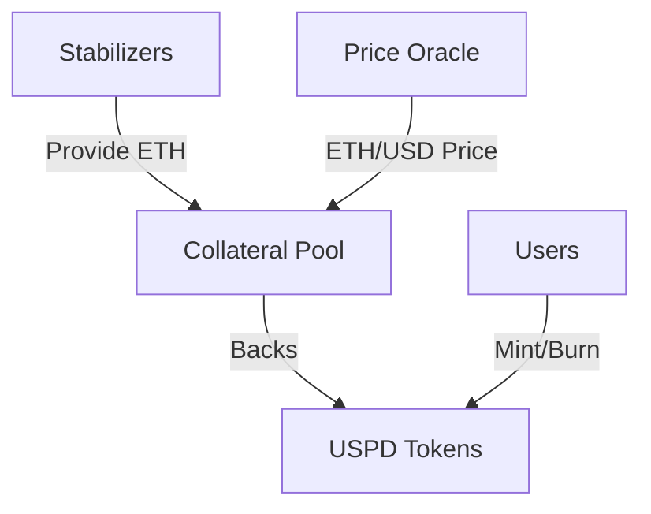
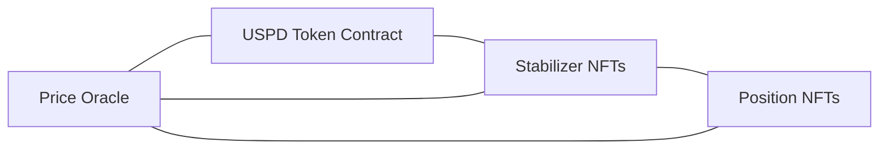

# USPD Documentation

USPD is a decentralized, permissionless stablecoin with on-chain proof of reserves, designed to maintain a stable 1:1 peg with USD through a unique stabilizer mechanism and ETH collateralization.

## Core Concepts

### 1. Decentralized Stability

USPD achieves price stability through a system of decentralized stabilizers rather than relying on centralized reserves. This approach ensures:

- Full transparency through on-chain verification
- Permissionless participation
- Robust stability mechanism

### 2. Stabilizer System

The stabilizer system consists of:
- NFT-based stabilizer positions
- Automated collateral management
- Dynamic overcollateralization
- Liquidation mechanisms

### 3. Collateralization Model

Every USPD token is backed by at least 110% of its value in ETH, ensuring:
- Strong price stability
- Protection against market volatility
- Incentives for stabilizers

## Key Features

### Permissionless Design
- Anyone can become a stabilizer
- No central authority controls the system
- Transparent rules enforced by smart contracts

### On-Chain Proof of Reserves
- All collateral visible on-chain
- Real-time verification of backing
- No off-chain dependencies

### Dynamic Stabilization
- Automatic collateral allocation
- Market-responsive stabilization
- Efficient capital utilization

## Getting Started

### For Users
- [Mint and Burn USPD](/docs/users/getting-started)
- [Understanding Price Stability](/docs/users/price-stability)
- [Trading USPD](/docs/users/trading)

### For Stabilizers
- [Becoming a Stabilizer](/docs/stabilizers)
- [Managing Collateral](/docs/stabilizers/add-collateral)
- [Understanding Liquidations](/docs/stabilizers/liquidation)

## Technical Architecture

The system comprises three main components:
1. **USPD Token Contract**: Manages token minting, burning, and overall system coordination
2. **Stabilizer NFTs**: Represents stabilizer positions and manages collateral
3. **Position NFTs**: Tracks allocated collateral and user positions

## Security Considerations

- Minimum 110% collateralization ratio
- Automated liquidation system
- Emergency fund for system stability
- Regular security audits

## Next Steps

- Explore the [Technical Documentation](/docs/technical)
- Learn about [Stabilizer Mechanics](/docs/stabilizers)
- Understand [Risk Management](/docs/risk)
