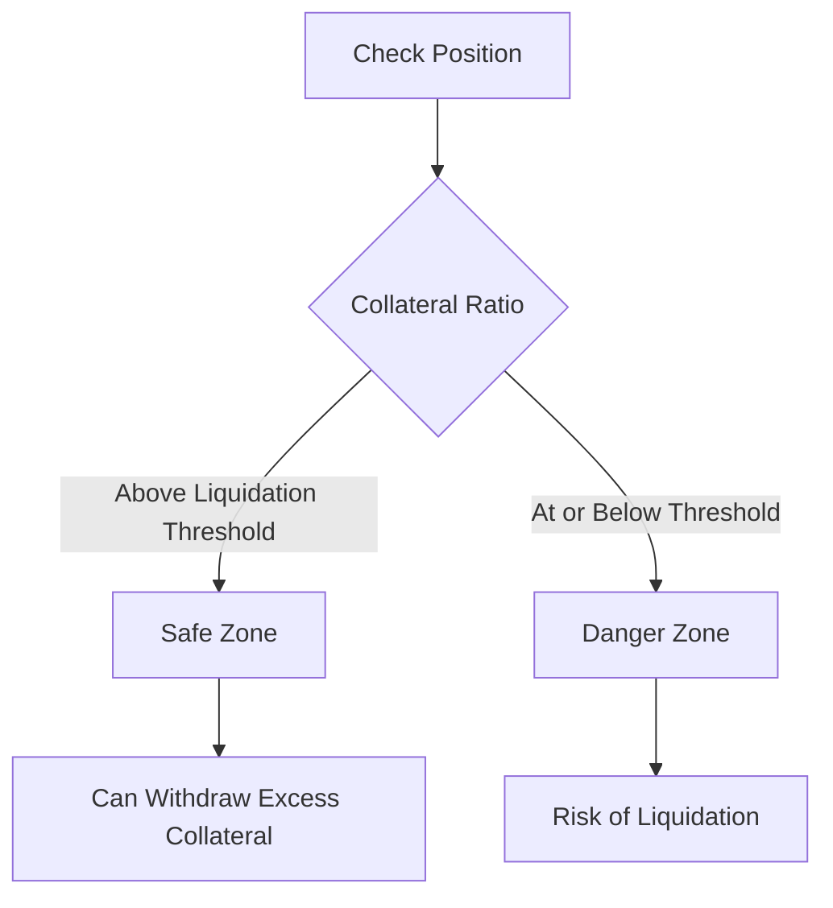

import Link from 'next/link'

# Adding Collateral to Stabilizers

Learn how to add collateral to your stabilizer position and manage it effectively to support the USPD system and avoid liquidation.

## Adding Initial Collateral

After minting a Stabilizer NFT, you must add ETH collateral to it. This collateral is held in your dedicated `StabilizerEscrow` and is used to overcollateralize USPD when users mint new tokens.

```solidity
// Add ETH collateral to your stabilizer's unallocated funds
function addUnallocatedFundsEth(uint256 tokenId) external payable {
    // The amount of ETH sent with the transaction becomes available collateral
}
```
For a detailed explanation of how this collateral is allocated, see the [USPD Architecture documentation](/docs/architecture).

## Managing Collateral Levels

### Checking Current Collateral

It is crucial to monitor your position's collateralization ratio to ensure it stays above its unique liquidation threshold (starting at 125% for NFT ID 1).



### Withdrawing Excess Collateral

If the price of ETH increases, your position's collateralization ratio will rise. This may allow you to withdraw the excess stETH collateral while still maintaining a ratio safely above your liquidation threshold.

1.  Calculate your current collateralization ratio.
2.  Determine the maximum amount of collateral you can withdraw.
3.  Execute the withdrawal transaction.

## Best Practices

1.  **Regular Monitoring**: Check your position's health frequently, especially during volatile market periods.
2.  **Buffer Maintenance**: Keep a healthy safety buffer above your position's specific liquidation threshold.
3.  **Price Awareness**: Monitor ETH price movements and their impact on your collateral value.
4.  **Gas Optimization**: Consider gas fees when adding or withdrawing collateral to optimize costs.

## Safety Considerations

-   Never let your collateralization ratio approach your position's liquidation threshold.
-   Maintain additional collateral in reserve to add quickly during market downturns.
-   Monitor gas prices for optimal transaction timing.

## Next Steps

-   Learn about the [Liquidation Process](/docs/stabilizers/liquidation)
-   Understand the complete [USPD Architecture](/docs/architecture)
