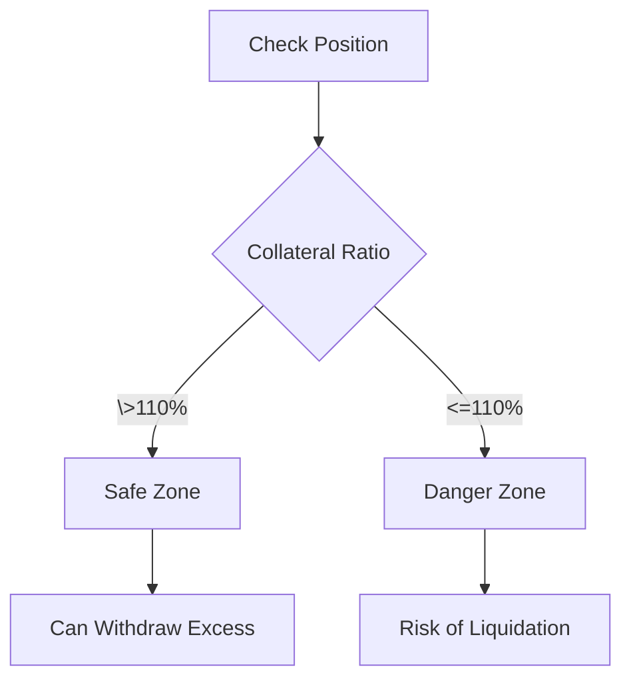

# Adding Collateral to Stabilizers

Learn how to add collateral to your stabilizer position and manage it effectively.

## Adding Initial Collateral

When you first receive a Stabilizer NFT, you can add ETH collateral that will be used to support USPD minting:

```solidity
// Add collateral to your stabilizer
function addUnallocatedFunds(uint256 tokenId) external payable {
    // Amount of ETH sent with transaction becomes available collateral
}
```

## Managing Collateral Levels

### Checking Current Collateral

Monitor your position's collateral ratio to ensure it stays above 110%:



### Withdrawing Excess Collateral

When ETH price increases, you can withdraw excess collateral while maintaining the minimum ratio:

1. Calculate current collateralization ratio
2. Determine maximum withdrawal amount
3. Execute withdrawal transaction

## Best Practices

1. **Regular Monitoring**: Check your position's health frequently
2. **Buffer Maintenance**: Keep a safety buffer above 110%
3. **Price Awareness**: Monitor ETH price movements
4. **Gas Optimization**: Batch operations when possible

## Safety Considerations

- Never let collateralization ratio approach 110%
- Maintain additional collateral for market volatility
- Monitor gas prices for optimal transaction timing

## Next Steps

- Learn about [Liquidation Process](/docs/stabilizers/liquidation)
- Understand [Position Management](/docs/stabilizers/manage-positions)
