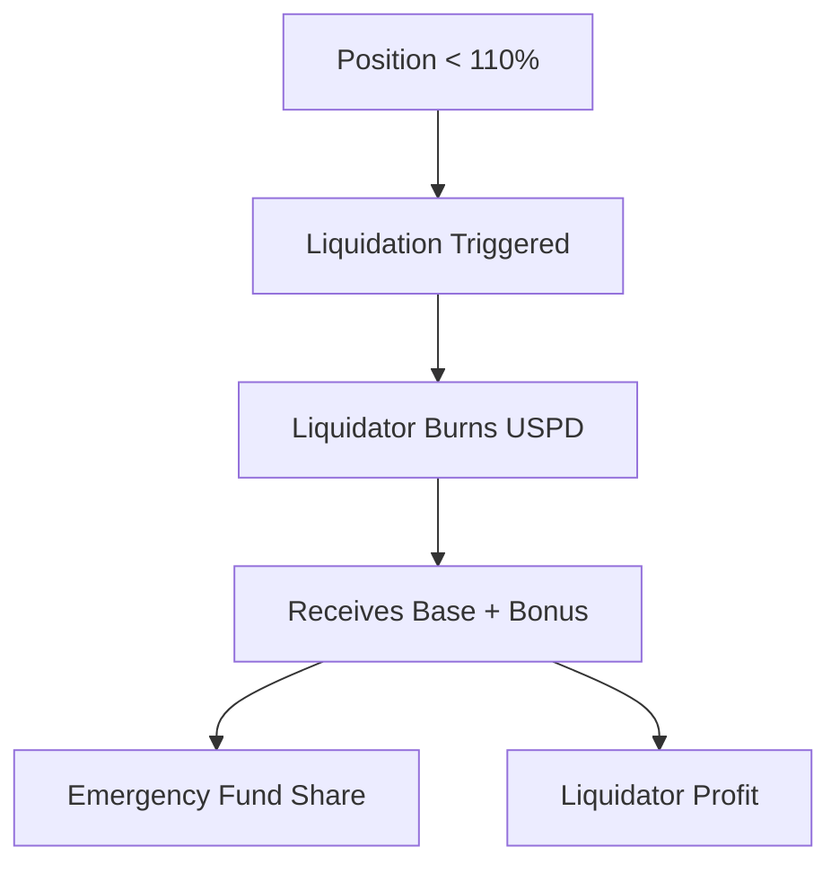

# Liquidation Process

Learn about the liquidation mechanism that helps maintain USPD's stability.

## When Liquidation Occurs

Liquidation becomes possible when a stabilizer position's collateralization ratio falls below 110%. This can happen due to:

- ETH price decreases
- Market volatility
- Insufficient position management

## Liquidation Mechanics



### Reward Distribution

When a position is liquidated:

1. Liquidator provides USPD tokens to burn
2. Receives 100% equivalent in ETH
3. Gets 50% of overcollateral as bonus
4. Remaining 50% goes to emergency fund

### Example Calculation

For a position with 108% collateralization:

```
Original Position: 100 USPD backed by 1.08 ETH
Liquidation Results in:
- 1.00 ETH → Liquidator (base)
- 0.04 ETH → Liquidator (50% of 0.08 excess)
- 0.04 ETH → Emergency Fund
```

## Emergency Fund

The emergency fund serves as:
- System stability buffer
- Protection against bank runs
- Reserve for unexpected events

## Best Practices for Stabilizers

1. Monitor position health regularly
2. Add collateral before reaching danger zone
3. Understand market conditions
4. Maintain sufficient buffers

## For Liquidators

- Monitor for liquidation opportunities
- Prepare USPD reserves
- Calculate profitability
- Consider gas costs

## Technical Implementation

The liquidation process is handled through smart contracts with specific checks and balances to ensure fair and efficient execution.
