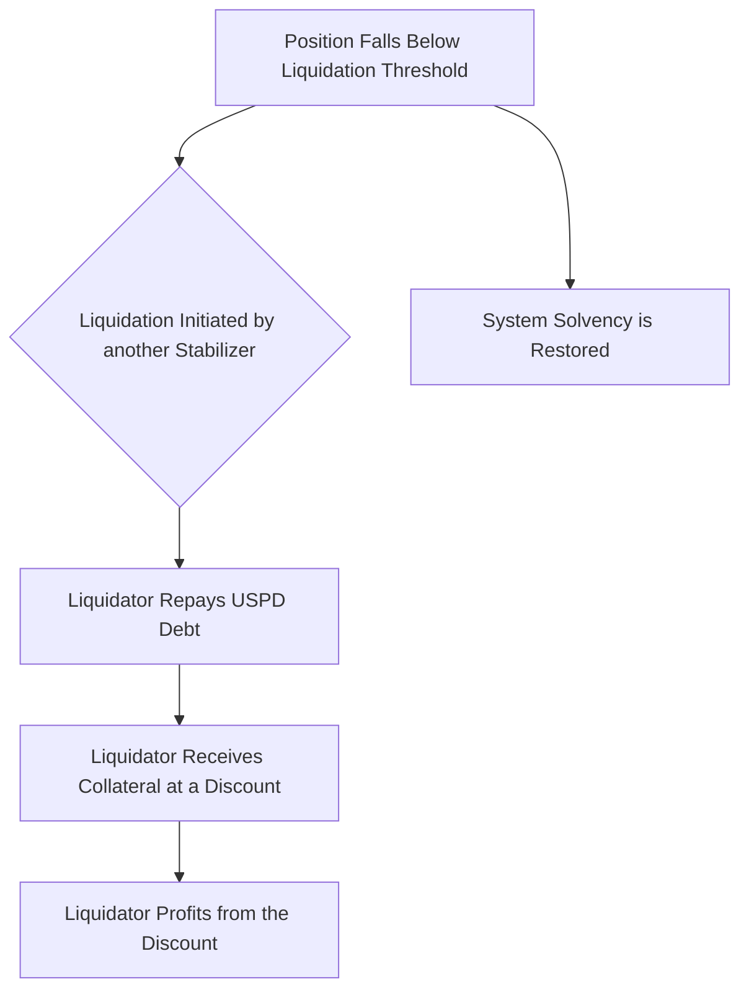

import { Button } from '@/components/ui/button'
import Link from 'next/link'

# Liquidation Process

The liquidation mechanism is a critical component that ensures the USPD system remains solvent and the 1:1 USD peg is maintained. It creates incentives for other Stabilizers to intervene when a position becomes undercollateralized.

## When Liquidation Occurs

A Stabilizer position becomes eligible for liquidation when its collateralization ratio falls below a certain threshold. The right to *initiate* this liquidation is a unique privilege granted to other Stabilizer NFT owners, and the specific collateralization ratio at which they can trigger a liquidation depends on their own NFT ID:

-   **Owner of Stabilizer NFT #1:** Can initiate liquidation if another position's ratio drops below **125%**.
-   **Owner of Stabilizer NFT #2:** Can initiate liquidation if another position's ratio drops below **124.5%**.
-   **Owner of Stabilizer NFT #3:** Can initiate liquidation if another position's ratio drops below **124%**.
-   ...and so on, decreasing by 0.5% for each subsequent ID.

This hierarchy ensures that there is always a strong incentive for senior stabilizers to maintain system health. A position can become undercollateralized due to a decrease in the price of ETH, which reduces the value of the underlying stETH collateral relative to the fixed USPD debt.

## Liquidation Mechanics

When a position is liquidated, the liquidating Stabilizer repays the outstanding USPD debt associated with that position. In return, they receive the position's underlying stETH collateral at a discount, which provides the financial incentive to perform the liquidation.

This process removes the risky position from the system and ensures that all outstanding USPD remains fully overcollateralized. For a detailed breakdown of the financial incentives and calculations, please see our economics documentation.

    <Button asChild>
        <Link href="/docs/economics">Explore Liquidation Economics</Link>
    </Button>

## Emergency Fund

A portion of the collateral from a liquidation event may be directed to a system-wide emergency fund. This fund serves as a secondary buffer to protect the system against extreme market events and ensure long-term stability.

## Best Practices for Stabilizers

1.  **Monitor Position Health:** Regularly check your position's collateralization ratio. To be safe from liquidation by any other Stabilizer, you must keep your ratio above 125%.
2.  **Maintain a Buffer:** Add collateral to keep your ratio comfortably above the 125% threshold.
3.  **Understand Market Conditions:** Be aware of ETH price movements and their potential impact on your position.

## For Liquidators

-   As a Stabilizer NFT owner, you have the right to liquidate other positions that fall below the threshold corresponding to your NFT ID.
-   Monitor the blockchain for undercollateralized positions that are eligible for liquidation.
-   Maintain a reserve of USPD to repay debt during a liquidation.
-   Analyze the potential profitability of a liquidation, considering the collateral discount and gas costs.