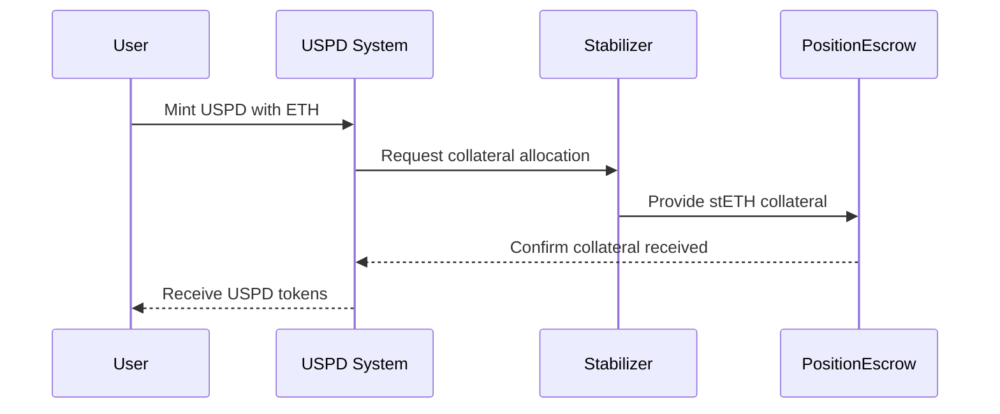

import { Button } from '@/components/ui/button'
import Link from 'next/link'

# USPD Stabilizers

Stabilizers are the backbone of the USPD ecosystem, providing the essential overcollateralization that ensures USPD maintains its 1:1 peg to the US Dollar. This document provides a high-level overview of how stabilizers work and their role in the system.

## What is a Stabilizer?

A stabilizer position is represented by a **Stabilizer NFT** (an ERC721 token). Owning one of these NFTs allows you to provide stETH collateral to the USPD system, participate in the stabilization process, and earn rewards.

For a detailed technical explanation of the entire process, from minting an NFT to capital allocation, please refer to the full system documentation.

    <Button asChild>
        <Link href="/docs/architecture">View USPD Architecture</Link>
    </Button>

## How Stabilizers Work

### Key Concepts

1.  **Overcollateralization**: Every USPD token is backed by more than its value in stETH. The minimum collateralization ratio required to avoid liquidation starts at **125%**.

2.  **Priority System**: Stabilizers are utilized for new USPD mints based on their NFT ID, with lower IDs having priority for capital allocation.

3.  **Dynamic Liquidation Threshold**: The liquidation threshold is not fixed. It starts at 125% for Stabilizer NFT #1 and decreases by 0.5% for each subsequent NFT (e.g., 124.5% for #2, 124% for #3).

### Collateralization Process

When a user mints USPD, they provide ETH as the base collateral. The system then taps into the available Stabilizer capital, allocating additional stETH from one or more Stabilizers to ensure the new USPD is overcollateralized above the required threshold.

## Become a Stabilizer

Anyone can become a stabilizer by minting a Stabilizer NFT. This is a permissionless process that allows you to participate directly in securing the USPD ecosystem.

    <Button asChild>
        <Link href="/stabilizer/mint">Mint a Stabilizer NFT</Link>
    </Button>

## Risk and Rewards

### Rewards
-   Potential to earn fees from providing stability to the system.
-   Ability to extract excess collateral as the price of ETH rises, creating leveraged opportunities.

### Risks
-   Your position can be liquidated if its collateralization ratio falls below its specific threshold.
-   Exposure to market volatility and the price of ETH.

## Related Topics

-   [Adding Collateral](/docs/stabilizers/add-collateral)
-   [Liquidation Process](/docs/stabilizers/liquidation)
-   [Economics of USPD](/docs/economics)
