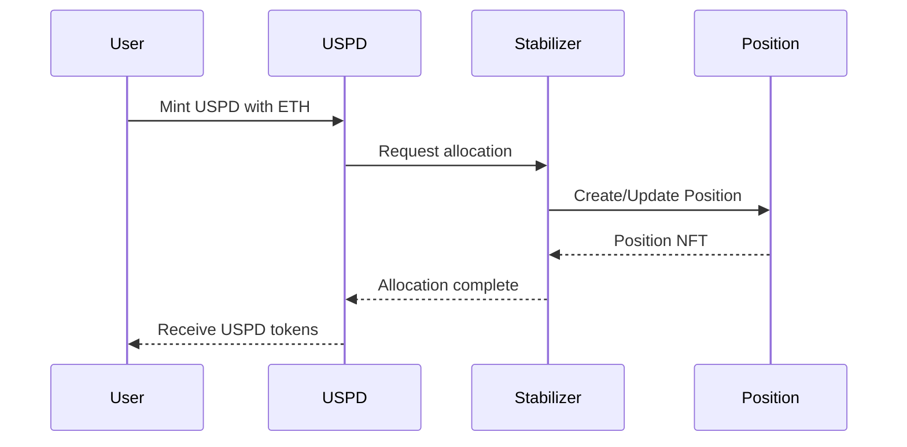

# USPD Stabilizers

Stabilizers are the backbone of USPD's stability mechanism, providing the overcollateralization that ensures USPD maintains its 1:1 USD peg. This document explains how stabilizers work and their role in the USPD ecosystem.

## What is a Stabilizer?

A stabilizer is represented by an NFT (ERC721 token) that allows holders to provide ETH collateral to the USPD system. These stabilizers play a crucial role in maintaining USPD's stability by ensuring that all USPD tokens are overcollateralized.

## How Stabilizers Work

### Key Concepts

1. **Overcollateralization**: Every USPD token is backed by more than 100% of its value in ETH. The minimum collateralization ratio is 110%.

2. **Priority System**: Stabilizers are processed in order of their NFT ID, with lower IDs having priority for capital allocation.

3. **Dynamic Collateral Management**: As ETH price fluctuates:
   - Rising ETH price → Increased overcollateralization
   - Falling ETH price → Decreased overcollateralization

### Collateralization Process

When a user mints USPD:

1. User provides ETH as collateral
2. System searches for available stabilizer capital
3. Stabilizers provide additional ETH to reach >110% collateralization
4. A Position NFT is created tracking the allocation

## Position Management

Stabilizers receive a Position NFT (UspdCollateralizedPositionNFT) representing their stake in the system. This position must maintain:

- Minimum 110% collateralization ratio
- Active monitoring of ETH price fluctuations
- Proper risk management

## Risk and Rewards

### Rewards
- Extract excess collateral when ETH price rises
- Earn from providing stability to the system

### Risks
- Position can be liquidated if collateralization falls below 110%
- Market volatility exposure

## Related Topics

- [Adding Collateral](/docs/stabilizers/add-collateral)
- [Liquidation Process](/docs/stabilizers/liquidation)
- [Managing Positions](/docs/stabilizers/manage-positions)
