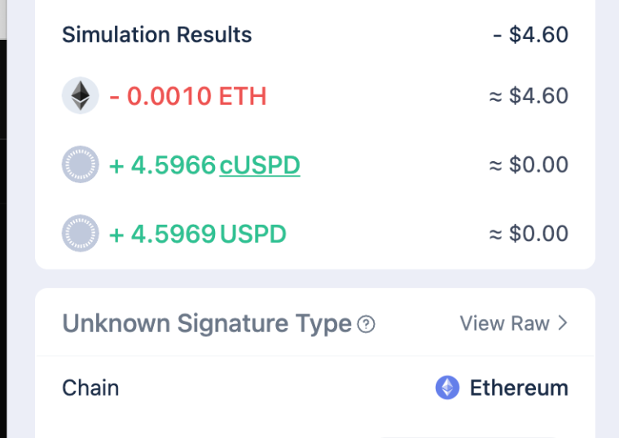

import { DeploymentAddresses } from '@/components/uspd/common/DeploymentAddresses'

# Contract Addresses

This page lists all deployed contract addresses and configuration details for each supported chain.

<DeploymentAddresses />

## Notes

- **Contract addresses** are the deployed smart contract instances for the USPD protocol
- **Configuration** includes important addresses like token contracts, oracles, and other dependencies
- **Deployment metadata** shows when and by whom the contracts were deployed
- Click the copy icon to copy full addresses to your clipboard
- Click the external link icon to view contracts on the respective block explorer

## USPD Versions with Mint and Burn

The USPD contract is a view layer on top of cUSPD. cUSPD holds user shares which are increasing in value. The value increase is calculated based on the Yield Factor and then presented as USPD tokens in the USPD contract. When minting or burning, the user is indirectly minting or burning both, cUSPD shares and USPD tokens and usually wallets present both values at the same time in the UI, like so:



There are currently two versions of the USPD contract deployed. The first version did not emit a Transfer event when minting and did not include a burn functionality which a lot of DeFi-Applications require. The new version includes the correct Transfer event and includes a burn function that works just as you would expect from any Mintable/Burnable ERC20 token. Both USPD versions work in parallel though, as they are just transparently forwarding transfer/mint/etc to the cUSPD contract. The old contract version is deployed on address `0xE58867673428E50146D2A3d10d28A6314D038238` across major blockchains. This website is updated to work with the new version.

## Programmatic Access

Instead of hard-coding contract addresses in your application, you can fetch the latest deployment data programmatically using our API endpoint:

### API Endpoint

```
GET /api/deployments
```

This endpoint returns an array of deployment data for all supported chains:

```json
[
  {
    "chainId": 11155111,
    "deployment": {
      "contracts": {
        "oracle": "0xAf6c3ee04f49Ac553823E9Ed44c57e9C9EF3aC88",
        "stabilizer": "0xe3aBe7FB1338D36450343D935400d486BE09C46d",
        "uspdToken": "0xeF9d72816d13AEBd3bb3ab4a3A4AECaC26F90CFB",
        // ... other contracts
      },
      "config": {
        "usdcAddress": "0x07865c6E87B9F70255377e024ace6630C1Eaa37F",
        "chainlinkAggregator": "0x694AA1769357215DE4FAC081bf1f309aDC325306",
        // ... other config values
      },
      "metadata": {
        "chainId": 11155111,
        "deploymentTimestamp": 1755852264,
        "deployer": "0x555350445E1f1ca212edB8cF397a383695ff7a36"
      }
    }
  }
]
```

### Usage Examples

**JavaScript/TypeScript:**
```javascript
// Fetch all deployments
const response = await fetch('/api/deployments');
const deployments = await response.json();

// Find deployment for specific chain
const sepoliaDeployment = deployments.find(d => d.chainId === 11155111);
const uspdTokenAddress = sepoliaDeployment?.deployment.contracts.uspdToken;
```

**React Hook:**
```javascript
import { useEffect, useState } from 'react';

function useDeployments() {
  const [deployments, setDeployments] = useState([]);
  
  useEffect(() => {
    fetch('/api/deployments')
      .then(res => res.json())
      .then(setDeployments);
  }, []);
  
  return deployments;
}
```

### Benefits of Using the API

- **Always up-to-date**: Automatically reflects the latest deployments
- **No hard-coding**: Eliminates the need to manually update addresses in your code
- **Multi-chain support**: Single endpoint for all supported networks
- **Type safety**: Use the existing `DeploymentInfo` type from `@/lib/contracts`

For more information about the deployment strategy and contract architecture, see the [Contracts and Deployments](/docs/uspd/contracts) page.
