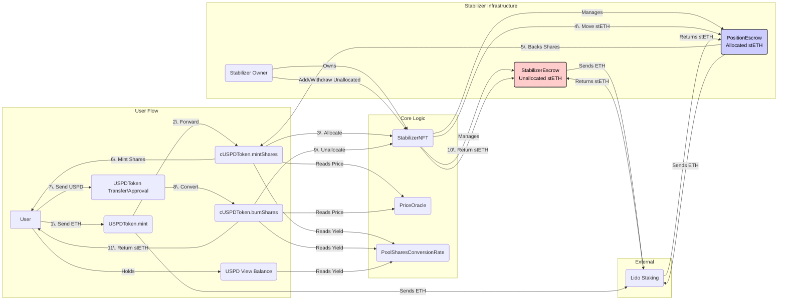

import { Steps } from 'nextra/components'

# USPD Architecture

## Overview

USPD (US Permissionless Dollar) is designed as a decentralized, yield-bearing stablecoin pegged 1:1 to the US Dollar. Its value is backed by overcollateralized stETH (Lido Staked Ether), and it natively accrues the yield generated by this underlying stETH collateral. The system aims to provide a stable store of value while offering passive income derived directly from Ethereum's staking rewards.

This document provides a technical and economic overview of the USPD system, targeting developers and economists interested in its mechanics, stability, and security.

## Core Concepts

1.  **USD Peg:** USPD aims to maintain a stable 1:1 peg with the US Dollar.
2.  **Native Yield:** USPD holders benefit from the staking yield generated by the underlying stETH collateral. This yield is reflected through a rebasing mechanism in the user-facing `USPDToken`.
3.  **Overcollateralization:** All minted USPD is backed by stETH collateral held in dedicated escrow contracts. The minimum collateralization ratio required to avoid liquidation is 125% for the most senior stabilizer, and this threshold decreases by 0.5% for each subsequent stabilizer.
4.  **Decentralized Stabilization:** The system relies on independent actors ("Stabilizers") to provide the excess collateral required for overcollateralization.
5.  **Capital Efficiency:** By utilizing yield-bearing stETH as collateral, the system aims for greater capital efficiency compared to non-yielding collateral types.

## System Actors

*   **Users:** Individuals or entities who mint, burn, hold, or transfer USPD. They benefit from the stable value and native yield.
*   **Stabilizers:** Entities that provide stETH collateral to the system to ensure overcollateralization. They are incentivized by earning fees from running leveraged, delta-neutral trading strategies. Each stabilizer position is represented by a `StabilizerNFT`.
*   **Liquidators:** A crucial part of the system. Actors who monitor for undercollateralized stabilizer positions and initiate liquidations to maintain system solvency, earning a reward in the process. The economics of liquidation are detailed in the [Economics documentation](/docs/economics).
*   **Keepers/Signers:** Off-chain actors running the USPD price oracle, which provides a real-time ETH/USD price. To ensure reliability, this price is cross-referenced with on-chain sources like Chainlink and the WETH/USDC Uniswap pool on mainnet. The price is invalidated if it deviates by more than 5% from these on-chain sources.
*   **Owner/Upgrader:** The contracts are upgradeable using the UUPS proxy pattern. The ownership, which allows for upgrades, is managed by a secure address (e.g., a multisig). There is a defined path for renouncing ownership to make contracts immutable, as described in the [contracts documentation](/docs/uspd/contracts).

## Token Structure: cUSPD vs USPD

The system employs a two-token structure to manage yield distribution cleanly:

1.  **`cUSPDToken` (Core USPD Share):**
    *   This is the core, **non-rebasing** ERC20 token.
    *   It represents a proportional share of the underlying stETH collateral pool managed by the system.
    *   The value of `cUSPD` accrues over time as the underlying stETH generates yield.
    *   It's designed for DeFi integrations, bridging, and internal system accounting where a non-rebasing unit is preferred.
    *   Minting and burning operations interact directly with this token.

2.  **`USPDToken` (Rebasing View Layer):**
    *   This is the user-facing ERC20 token that maintains the 1:1 USD peg.
    *   It **rebases** its balance to reflect the accrued stETH yield.
    *   `USPDToken` acts as a view layer on top of `cUSPDToken`. Its `balanceOf` and `totalSupply` functions calculate the USPD equivalent based on the user's `cUSPD` share balance and the current stETH yield factor obtained from the `PoolSharesConversionRate` contract.
    *   Transfers and approvals initiated via `USPDToken` are converted into corresponding `cUSPD` share amounts before interacting with the `cUSPDToken` contract.

This separation allows the core accounting (`cUSPD`) to remain simple while providing the desired user experience (stable peg + yield) through the `USPDToken` view.

## Key Contracts and Architecture

The USPD system comprises several interconnected smart contracts:

*   **`StabilizerNFT` (`StabilizerNFT.sol`):**
    *   An ERC721 contract where each token represents a unique stabilizer position.
    *   Manages the lifecycle of stabilizer positions, including minting NFTs, tracking collateral preferences (min ratio), and linking to dedicated escrow contracts.
    *   Orchestrates the allocation and unallocation of collateral during USPD minting and burning by interacting with `StabilizerEscrow`, `PositionEscrow`, and `cUSPDToken`.
    *   Deploys `StabilizerEscrow` and `PositionEscrow` clones for each NFT using `Clones.clone`.
    *   Maintains linked lists (`lowest/highestUnallocatedId`, `lowest/highestAllocatedId`) to efficiently find available stabilizer collateral.
    *   Receives collateral addition/removal reports from `PositionEscrow` via callbacks (`reportCollateralAddition`, `reportCollateralRemoval`) to update the global collateral snapshot via the `OvercollateralizationReporter`.

*   **`StabilizerEscrow` (`StabilizerEscrow.sol`):**
    *   A dedicated vault holding **unallocated** stETH for a *single* `StabilizerNFT`.
    *   Deployed as a clone by `StabilizerNFT`.
    *   Receives initial and subsequent stETH deposits (via ETH conversion using Lido) from the stabilizer owner, forwarded by `StabilizerNFT`.
    *   Allows `StabilizerNFT` to approve collateral (`approveAllocation`) for transfer to a `PositionEscrow` during allocation.
    *   Allows `StabilizerNFT` to withdraw unallocated stETH (`withdrawUnallocated`) back to the stabilizer owner.

*   **`PositionEscrow` (`PositionEscrow.sol`):**
    *   Holds the **combined, allocated** stETH collateral (user's staked ETH + stabilizer's contribution) backing a specific portion of the minted USPD liability.
    *   Deployed as a clone by `StabilizerNFT`.
    *   Receives stETH from the user (via ETH conversion using Lido in `addCollateralFromStabilizer` or `addCollateralEth`) and from the `StabilizerEscrow` (transferred by `StabilizerNFT`).
    *   Tracks the amount of `cUSPD` liability (`backedPoolShares`) it is responsible for collateralizing.
    *   Allows the stabilizer owner (`EXCESSCOLLATERALMANAGER_ROLE`) to remove excess collateral (`removeExcessCollateral`) if the position's ratio is above their personally set minimum.
    *   Allows `StabilizerNFT` (`STABILIZER_ROLE`) to remove collateral during unallocation (`removeCollateral`).
    *   Provides a view function (`getCollateralizationRatio`) to calculate its current collateralization ratio.
    *   Reports direct collateral additions/removals back to `StabilizerNFT` via callbacks.

*   **`PoolSharesConversionRate` (`PoolSharesConversionRate.sol`):**
    *   Tracks the yield generated by stETH.
    *   Holds an initial stETH deposit made during deployment.
    *   Calculates the `yieldFactor` by comparing the current stETH balance (affected by rebasing) to its initial stETH balance.
    *   `yieldFactor = (current_stETH_balance * FACTOR_PRECISION) / initial_stETH_balance`.
    *   Used by `USPDToken` to calculate rebasing balances and by `cUSPDToken` during mint/burn calculations.

*   **`cUSPDToken` (`cUSPDToken.sol`):**
    *   The core ERC20 share token.
    *   Handles the primary mint (`mintShares`) and burn (`burnShares`) logic.
    *   Interacts with `PriceOracle` to get the current ETH/USD price.
    *   Interacts with `StabilizerNFT` to trigger collateral allocation (`allocateStabilizerFunds`) or unallocation (`unallocateStabilizerFunds`).
    *   Interacts with `PoolSharesConversionRate` to get the `yieldFactor` for share calculations.
    *   Deployed using CREATE2 for a deterministic address across chains.

*   **`USPDToken` (`UspdToken.sol`):**
    *   The rebasing ERC20 view-layer token.
    *   Overrides standard ERC20 functions (`balanceOf`, `totalSupply`, `transfer`, `approve`, `transferFrom`, `allowance`).
    *   Calculates USPD amounts by converting `cUSPD` shares using the `yieldFactor` from `PoolSharesConversionRate`.
    *   Delegates actual share transfers/approvals to the `cUSPDToken` contract.
    *   Deployed using CREATE2 for a deterministic address across chains.

*   **`PriceOracle` (`PriceOracle.sol`):**
    *   Provides validated ETH/USD price information.
    *   Uses an `attestationService` requiring signed price data from authorized off-chain signers.
    *   Upgradeable via the UUPS proxy pattern. On Ethereum Mainnet, it validates its price against Chainlink and Uniswap. On testnets like Sepolia, these on-chain checks are disabled due to unstable price feeds.

*   **`OvercollateralizationReporter` (`OvercollateralizationReporter.sol`):**
    *   Tracks a global snapshot of the system's total collateral value (in ETH equivalent) and the yield factor at the time of the last update.
    *   Receives updates (`updateSnapshot`) from `StabilizerNFT` whenever collateral is added or removed from the active pool (PositionEscrows).
    *   Calculates an *approximate* system-wide collateralization ratio (`getSystemCollateralizationRatio`) based on the projected snapshot value and the total `cUSPD` supply. This provides a general health indicator but doesn't replace individual `PositionEscrow` ratio checks for liquidations.
    *   Upgradeable via the UUPS proxy pattern.

## Core Mechanisms

<Steps>

### Stabilizer Setup

1.  An entity wishing to become a Stabilizer mints a new `StabilizerNFT`. This is a permissionless action and can be performed by anyone.
2.  The `StabilizerNFT` contract automatically deploys dedicated `StabilizerEscrow` and `PositionEscrow` clones for this NFT.
3.  The Stabilizer deposits collateral (ETH or stETH) into their `StabilizerEscrow` via the `StabilizerNFT`'s `addUnallocatedFundsEth` or `addUnallocatedFundsStETH` functions. ETH deposits are automatically staked into stETH via Lido within the `StabilizerEscrow`.
4.  The Stabilizer can set a minimum desired collateralization ratio for their position using `StabilizerNFT.setMinCollateralizationRatio` to manage their own risk, which must be above the system's liquidation threshold for their NFT.

### Minting USPD

1.  A user initiates a mint transaction by sending ETH to `cUSPDToken.mintShares`, specifying the recipient address and providing a recent, signed price attestation (`PriceAttestationQuery`) from an authorized oracle signer.
2.  `cUSPDToken` validates the price attestation via `PriceOracle.attestationService`.
3.  `cUSPDToken` calculates the target `cUSPD` shares based on the user's ETH value (using the validated price) and the current `yieldFactor` from `PoolSharesConversionRate`.
4.  `cUSPDToken` calls `StabilizerNFT.allocateStabilizerFunds`, forwarding the user's ETH and the validated price.
5.  `StabilizerNFT` iterates through the `unallocated` list of Stabilizer NFTs (starting from `lowestUnallocatedId`).
6.  For each available Stabilizer, `StabilizerNFT` calculates the stETH needed from the stabilizer to back a portion of the user's ETH at the stabilizer's `minCollateralRatio`.
7.  `StabilizerNFT` instructs the relevant `StabilizerEscrow` to approve the transfer of the required stabilizer stETH.
8.  `StabilizerNFT` transfers the approved stETH from `StabilizerEscrow` to the corresponding `PositionEscrow`.
9.  `StabilizerNFT` calls `PositionEscrow.addCollateralFromStabilizer`, sending the user's ETH portion. Inside `PositionEscrow`, the user's ETH is staked via Lido, and the total stETH (user's + stabilizer's) is acknowledged (`CollateralAdded` event).
10. `StabilizerNFT` calculates the `cUSPD` shares corresponding to the user's ETH portion allocated to this position and calls `PositionEscrow.modifyAllocation` to update its `backedPoolShares`.
11. `StabilizerNFT` adds the Stabilizer NFT to the `allocated` list if it wasn't already there and removes it from the `unallocated` list if its `StabilizerEscrow` is now empty.
12. `StabilizerNFT` accumulates the total ETH equivalent added across all involved positions and calls `OvercollateralizationReporter.updateSnapshot`.
13. `StabilizerNFT` returns the total user ETH successfully allocated (`result.allocatedEth`) to `cUSPDToken`.
14. `cUSPDToken` calculates the final `cUSPD` shares based on `result.allocatedEth` and mints them to the recipient.
15. Any leftover user ETH (if not enough stabilizer collateral was found) is refunded to the original minter (`msg.sender` of `mintShares`).
16. The user now holds `cUSPD` shares. They can view their equivalent USPD balance via the `USPDToken` contract.

### Yield Generation & Distribution

1.  The stETH held within all `PositionEscrow` contracts (and the `PoolSharesConversionRate` contract itself) receives staking rewards through Lido's rebasing mechanism.
2.  The `PoolSharesConversionRate` contract's `getYieldFactor()` function reflects the overall growth of stETH relative to the initial deposit.
3.  The `USPDToken` contract reads this `yieldFactor` when calculating balances (`balanceOf`, `totalSupply`).
4.  As the `yieldFactor` increases, the USPD balance corresponding to a fixed amount of `cUSPD` shares increases, effectively distributing the yield to USPD holders through balance rebasing.

### Burning USPD (Redeeming Collateral)

1.  A user initiates a burn by calling `cUSPDToken.burnShares`, specifying the amount of `cUSPD` shares to burn, the recipient for the collateral, and a valid `PriceAttestationQuery`.
2.  `cUSPDToken` validates the price query via `PriceOracle`.
3.  `cUSPDToken` burns the specified `sharesAmount` from the caller (`msg.sender`).
4.  `cUSPDToken` calls `StabilizerNFT.unallocateStabilizerFunds`, passing the `sharesAmount` and the validated price response.
5.  `StabilizerNFT` iterates through the `allocated` list (starting from `highestAllocatedId`).
6.  For each allocated Stabilizer, `StabilizerNFT` determines how many shares (`poolSharesSliceToUnallocate`) can be unbacked by this position.
7.  `StabilizerNFT` calls `_calculateUnallocationFromEscrow` which uses the `PositionEscrow.getCollateralizationRatio` to determine the total stETH (`stEthToRemove`) to withdraw based on the shares being unallocated and the current ratio. It also calculates the user's proportional share (`userStEthShare`) based on the par value (derived from the oracle price and yield factor).
8.  `StabilizerNFT` calls `PositionEscrow.modifyAllocation` to decrease its `backedPoolShares`.
9.  `StabilizerNFT` calls `PositionEscrow.removeCollateral`, instructing it to send the `stEthToRemove` (both user and stabilizer portions) back to the `StabilizerNFT` contract address.
10. `StabilizerNFT` receives the stETH. It transfers the `userStEthShare` portion to the `cUSPDToken` contract and the stabilizer's portion back to the corresponding `StabilizerEscrow`.
11. `StabilizerNFT` updates the `allocated` and `unallocated` lists as needed.
12. `StabilizerNFT` accumulates the total ETH equivalent removed and calls `OvercollateralizationReporter.updateSnapshot` with a negative delta.
13. `StabilizerNFT` returns the total `userStEthShare` collected to `cUSPDToken`.
14. `cUSPDToken` receives the total user stETH share from `StabilizerNFT` and transfers it to the recipient specified by the user.
15. Events (`SharesBurned`, `Payout`) are emitted.

### Maintaining Overcollateralization

*   **Stabilizer Action (Price Increase):** If the ETH/USD price increases, the value of the stETH collateral in a `PositionEscrow` rises relative to the fixed USD liability. The collateralization ratio increases. The stabilizer owner can call `PositionEscrow.removeExcessCollateral` to withdraw the surplus collateral above their personally set minimum ratio.
*   **Stabilizer Action (Price Decrease):** If the ETH/USD price decreases, the collateralization ratio drops. The stabilizer is responsible for monitoring their position. If the ratio approaches their liquidation threshold, they should add more collateral (ETH or stETH) directly to the `PositionEscrow` to avoid being liquidated.

### Liquidation

*   **Trigger:** A stabilizer's position falls below its specific liquidation threshold (starting at 125% for the most senior position and decreasing by 0.5% for each subsequent one).
*   **Action:** A liquidator can call the liquidation function on the `StabilizerNFT` contract, targeting the undercollateralized position.
*   **Process:** The liquidator repays a portion of the debt associated with the undercollateralized position. In return, the liquidator receives the position's stETH collateral at a discount, earning a profit. This process removes the risky position from the system and ensures that the total value of collateral in the system remains greater than the value of all minted USPD. For a detailed breakdown of the incentives and mechanics, see the [Economics documentation](/docs/economics).

</Steps>

## Security Considerations

*   **Oracle Security:** The system heavily relies on the `PriceOracle`.
    *   *Mitigation:* Requires signed attestations, validates against on-chain sources (Chainlink, Uniswap) on mainnet, and enforces staleness checks and deviation limits. Signer key security is crucial. Oracle contract upgradeability requires careful governance.
*   **Smart Contract Risk:** Bugs in any core contract could lead to loss of funds or system malfunction.
    *   *Mitigation:* Code audits, extensive testing (unit, integration, fuzzing), adherence to best practices, use of established libraries (OpenZeppelin), and UUPS upgradeability for bug fixes.
*   **stETH De-peg Risk:** While stETH generally tracks ETH price, a significant de-peg could impact collateral value calculations and potentially trigger liquidations even if ETH price is stable.
    *   *Mitigation:* System relies on stETH maintaining its peg. Overcollateralization provides a buffer. Monitoring stETH health is important.
*   **Yield Dependency:** The yield mechanism relies on Lido continuing to generate staking rewards.
    *   *Mitigation:* Lido is a mature protocol, but this is an external dependency.
*   **Centralization Risks:** The ability to upgrade contracts via the UUPS proxy pattern is a powerful privilege.
    *   *Mitigation:* This power is managed by a secure address (e.g., a multisig with a timelock). The system is designed with a path to renounce this upgradeability, which would make the contracts immutable. This process is detailed in our [contracts documentation](/docs/uspd/contracts). The security of oracle signer keys is also critical.
*   **Gas Costs:** The allocation/unallocation loops in `StabilizerNFT` could consume significant gas, potentially limiting the number of positions processed in one transaction or making mint/burn operations expensive during high activity.
    *   *Mitigation:* Gas optimizations in loops, potential for off-chain matching or alternative allocation mechanisms in future versions. `MIN_GAS` checks provide a basic safeguard against running out of gas mid-loop.
*   **Liquidation Mechanism Design:** The liquidation mechanism is designed to be profitable for liquidators and fair to stabilizers, while preventing cascading failures. Front-running risks during liquidations must be considered.
*   **Proxy Upgradeability:** While allowing fixes, improper upgrade procedures or malicious upgrades by the owner can introduce vulnerabilities.
    *   *Mitigation:* Use of the UUPS proxy pattern, and governance procedures around upgrades (timelocks, community review).

## Economic Considerations

*   **Peg Stability:** Primarily maintained by the overcollateralization and the liquidation mechanism. Arbitrage opportunities (minting/burning vs. market price) should also help maintain the peg.
*   **Yield Source:** Directly tied to Ethereum staking rewards via stETH. Changes in staking APR will affect the USPD yield.
*   **Stabilizer Incentives:** Stabilizers lock up capital (stETH) and take on price risk. Their incentive is primarily earning fees from running leveraged, delta-neutral trading strategies. The ability to withdraw excess collateral allows them to manage capital.
*   **Liquidity:** Sufficient liquidity on DEXs (e.g., Uniswap) for USPD/cUSPD is crucial for peg stability and for liquidators to operate effectively.
*   **Scalability:** The system's ability to scale depends on attracting sufficient stabilizer collateral to meet minting demand and the gas efficiency of the allocation/unallocation mechanisms.

## Cross-Chain Strategy

*   **Deterministic Addresses:** `cUSPDToken` and `USPDToken` are deployed using CREATE2, ensuring the same contract addresses on all supported EVM chains.
*   **Bridging:** `cUSPD` (the non-rebasing token) is intended for bridging between L1 (Mainnet) and L2s (e.g., Base, Arbitrum). A cross-chain messaging protocol like LayerZero is planned for facilitating these transfers.
*   **L1 Hub:** The core stabilization logic (StabilizerNFT, Escrows, Reporter, RateContract) resides on L1 where the primary stETH collateral is held. L2 deployments primarily serve as access points for the token itself.
