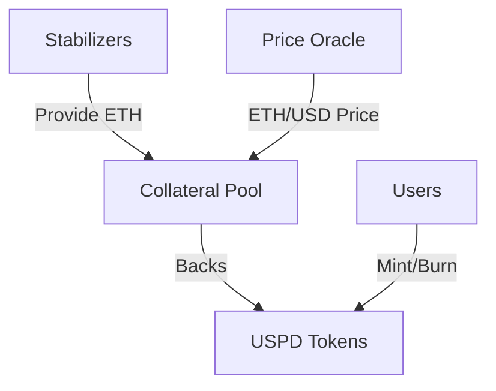

import LandingPageStats from '@/components/uspd/reporter/LandingPageStats'
import { ReporterContractLink } from '@/components/uspd/reporter/ReporterContractLink'
import { Button } from '@/components/ui/button'
import Link from 'next/link'

# USPD Documentation

USPD is a decentralized, permissionless, and natively yield-bearing stablecoin with on-chain proof of reserves, designed to maintain a stable 1:1 peg with USD through a unique stabilizer mechanism and ETH collateralization.

## Core Concepts

### 1. Decentralized Stability

USPD achieves price stability through a system of decentralized stabilizers rather than relying on centralized reserves. This approach ensures full transparency through on-chain verification. You can see the live system status below, fetched directly from the blockchain.

  <LandingPageStats />

  <ReporterContractLink />

For a visual, step-by-step explanation of how the system works, check out our interactive guide.

    <Button asChild>
        <Link href="/how-it-works">Explore How It Works</Link>
    </Button>

### 2. Stabilizer System

The stabilizer system consists of:
- NFT-based stabilizer positions
- Automated collateral management
- Dynamic overcollateralization
- Liquidation mechanisms

To dive deeper into the economic incentives and liquidation processes that keep the system stable, read our [Economics documentation](/docs/economics).

### 3. Collateralization Model

Every USPD token is backed by a surplus of ETH collateral. The minimum collateralization ratio is 125%, which is the liquidation threshold for the first and most senior stabilizer (ID 1). For each subsequent stabilizer, this threshold decreases by 0.5% (e.g., 124.5% for ID 2, 124% for ID 3). This mechanism incentivizes early participation and ensures robust overcollateralization across the network, protecting the system against market volatility.

## Key Features

USPD is designed from the ground up to be a truly decentralized and censorship-resistant stablecoin.

- **Self-Issued & Non-Custodial**: Users mint USPD by locking their own ETH as collateral. You always maintain control over your assets.
- **Non-Freezable**: The USPD token contract has no functionality to freeze or seize your funds. What you own is yours.
- **Permissionless**: Anyone can mint USPD or become a stabilizer without requiring permission from any central entity.
- **Independent of Traditional Finance**: USPD's value is backed by on-chain ETH, not by funds held in a bank account or by US treasuries. This insulates it from risks within the traditional banking system.

## Get Started with USPD

Ready to experience a truly decentralized stablecoin? You can mint your first USPD now.

    <Button asChild>
        <Link href="/uspd">Mint USPD</Link>
    </Button>

